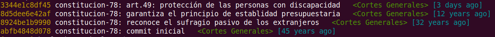

= La Constitución Española en _git_

Este repositorio recoge la ley fundamental de España (Constitución Española) como si se tratara de un repositorio de código fuente en link:https://es.wikipedia.org/wiki/Git[_git_], de modo que se puedan ver sus cambios a lo largo de la historia.

== Motivación

Cada cierto tiempo, suenan campanas sobre posibles modificaciones que deben hacerse a la Constitución Española (C.E.).
Temas como la eliminación de la preferencia del varón sobre la mujer en la herencia de la Corona, discusiones sobre el término _nacionalidades_ del artículo 2, uso de lenguaje inclusivo, reforma del estado autonómico, etc.

Desde su promulgación en 1978, ya ha habido dos modificaciones de la C.E.; sin embargo, no resulta especiamente fácil ver las diferencias con respecto al texto original.
El Boletín Oficial del Estado (B.O.E.) publica las modificaciones de un modo parecido a este:

[quote]
--
Artículo único.

El apartado 2 del artículo 13 de la Constitución Española queda redactado como sigue:

   <texto nuevo aquí>
--

Como programador que soy, y acostumbrado a revisar diferencias de código en el sistema de control de versiones _git_, me pareció que estaría bien poder ver las modificaciones con respecto al texto anterior, sin tener que cambiar continuamente entre la versión anterior y la nueva.
Pero, sobre todo, deseo poder revisar los cambios que, seguro, están por venir.

== Cómo ver las diferencias

Existen multitud de herramientas de código abierto que pueden procesar y mostrar los _commits_ (cambios de código) de forma visual.
Es así como trabajamos en la revisión por pares de código fuente en proyectos como el _kernel_ de Linux.

En _GitHub_, es tan sencillo como ir a la link:https://github.com/hpalacio/leyes/commits/master/constitucion-espanola-1978.adoc[historia del fichero `constitucion-espanola-1978.adoc`] y hacer click en cada _commit_.

image::img/diff-github-articulo13.png[]

Como historia para un repositorio no parece gran cosa, pero supongo que eso dice mucho de la buena redacción de la Constitución.

=== Ver propuestas de cambio

Cuando algún organismo o partido político sugiera algún cambio en la Constitución Española, puedo publicarlo como un _Pull request_, que es como llamamos los programadores a las solicitudes de cambio de código.

Actualmente, existen varias propuestas de reforma de la Consititución admitidas a trámite por las Cortes que se pueden consultar en los link:https://github.com/hpalacio/leyes/pulls[_Pull requests_ abiertos]:

- [x] link:https://github.com/hpalacio/leyes/pull/3[Protección de las personas con discapacidad] MERGED
- [ ] link:https://github.com/hpalacio/leyes/pull/4[Participación ciudadana en decisiones trascendentes]
- [ ] link:https://github.com/hpalacio/leyes/pull/5[Reintegración efectiva del Derecho Civil valenciano]
- [ ] link:https://github.com/hpalacio/leyes/pull/8[Senador propio para la isla de Formentera]

Otro ejemplo: el 16 de enero de 2020, y a petición de la vicepresidenta del Gobierno, la Real Academia Española emitió un informe sobre el lenguaje inclusivo en la C.E.
Basándome en dicho informe, he creado un link:https://github.com/hpalacio/leyes/pull/1[_Pull request_ con las sugerencias de la R.A.E.] para mejorar el texto constitucional en ese sentido.

== Metodología

=== Lenguaje de _markup_

El sistema de control de versiones _git_ funciona sobre ficheros de texto plano.
Además, el objetivo del proyecto es poder ver las *diferencias de contenido*, por lo que hay que usar un lenguaje de _markup_ que tenga el mínimo impacto sobre el contenido.

Los textos legislativos usan fundamentalmente listas ordenadas y, en ese sentido, el lenguaje _Markdown_ no es muy flexible, ya que no permite intervenir sobre el símbolo que se utiliza en las listas.
Así que me he decantado por el lenguaje _AsciiDoc_ que sí lo permite y está soportado por _GitHub_ y _GitLab_.

=== Fuente

La fuente de los textos es el B.O.E.

=== Convenciones

* Cada oración ocupa una línea de texto.
Esto tiene dos ventajas:
** Como _git_ muestra diferencias a nivel de líneas, permite ver frases completas que han sido modificadas.
** En _AsciiDoc_, los retornos de línea no implican un punto y aparte (tan solo punto y seguido), por lo que el formato original se mantiene en el HTML generado.
* Para las listas se utiliza el lenguaje de _markup_.
** *Ventaja*: el HTML generado tabula correctamente los ítems, lo que permite una mejor lectura incluso que la que muestra el propio B.O.E. en su página web.
** *Inconveniente*: en listas con letras, o con números a partir del segundo nivel en adelante, el _markup_ no permite anteponer el símbolo (número o letra) en el código fuente.
No queda otra que usar un punto seguido de un espacio `. `) para cada ítem de una lista ordenada, lo que hace que se pierda dicho símbolo en el código fuente (aunque sale bien en el HTML generado).
Por ejemplo:
+
image::img/lista-ordenada-nivel2.png[]

=== Proceso

En pocas palabras, consiste en:

* Copiar el texto del B.O.E.
* Formatearlo en _AsciiDoc_ siguiendo las <<convenciones>>.
* Generar el _commit_, usando:
** como autor a las Cortes Generales;
** como título, un resumen del cambio;
** como descripción, las motivaciones de la ley;
** como firmas, las de las personas que intervinien en él.
* Modificar la fecha del _commit_ para que corresponda a la fecha de publicación en el B.O.E.
Eso lo hago con un comando como este:
+
....
~$ GIT_COMMITTER_DATE="Fri 29 Dec 1978 12:00:00 CEST" git commit --amend --no-edit --date "Fri 29 Dec 1978 12:00:00 CEST"
....
